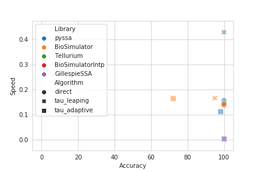

# Goal

The goal of this repository is to compare the different softwares used for stochastic / Gillespie type simulations (see below) on two fronts

- Accuracy of simulation
- Speed of simulation

# Table of contents

  * [Background](#background)
   * [Libraries compared](#libraries-compared)
   * [Quick results : what algorithm to use?](#quick-results--what-algorithm-to-use)
   * [Methods](#methods)
      * [Accuracy comparison](#accuracy-comparison)
      * [Speed comparison](#speed-comparison)
   * [Results](#results)
      * [Example results from comparisons](#example-results-from-comparisons)
   * [How to run the code in this repository](#how-to-run-the-code-in-this-repository)
      * [Accuracy tests](#accuracy-tests)
      * [Speed tests](#speed-tests)


# Background
Stochastic simulations (see [Wikipedia](https://en.wikipedia.org/wiki/Gillespie_algorithm)) are used to model biological processes or chemical reactions when the corresponding differential equations cannot be applied. This may be the case when the number of species being modeled is very small (such as 10s of molecules/biological species), and the randomness becomes important. A simple example is a starting with a small number of bacteria (say 5) in a dish. They may either all die out, or they may start dividing and growing rapidly. The outcome itself is random, and you would use a Gillespie simulator to model such a process.


# Libraries compared

We compare the 4 libraries across Python, R and Julia. These are listed below along with the algorithms in each library.

Library | Language | Algorithm name in library | Algorithm name in our comparison | Standard name of algorithm
---| --- | --- | --- | ----
cayenne (v0.9.1) | Python (v3.6.9) | `direct` | `direct` | Gillespie's Direct method ([Gillespie1973][direct])
| | | `tau_leaping` | `tau_leaping` | Standard tau leaping ([Gillespie2001][tau_leaping] also see [Wikipedia][tau_leaping_wiki])
| | | `tau_adaptive` | `tau_adaptive` | Tau leaping with efficient step size selection ([Cao. et al. 2006][tau_adaptive])
Tellurium (v2.1.5) | Python (v3.6.9) | `gillespie` | `direct` | Unknown (see [here](https://tellurium.readthedocs.io/en/latest/_notebooks/core/tellurium_stochastic.html?highlight=gillespie#stochastic-simulation)), likely similar to Gillespie's Direct Method
GillespieSSA (v0.6.1) | R (v3.6.1) | `ssa.d` | `direct` | Gillespie's Direct method ([Gillespie1973][direct])
| | | `ssa.etl` | `tau_leaping` |  Standard tau leaping ([Gillespie2001][tau_leaping] also see [Wikipedia][tau_leaping_wiki])
| | | `ssa.otl` | `tau_adaptive` | Tau leaping with efficient step size selection ([Cao. et al. 2006][tau_adaptive])
BioSimulator.jl (v0.9.3)| Julia (v1.4.0) | `Direct` | `direct` |  Gillespie's Direct method ([Gillespie1973][direct])
| | | `TauLeapingDGLP2003` | `tau_leaping` | Improved leap-size selection for accelerated stochastic simulation ([Gillespie and Petzold 2003][dglp2003])
| | | `HybridSAL` | `tau_adaptive` | Step anticipation tau-leaping (SAL) algorithm that defaults to `Direct` depending on cumulative density ([Sehl et. al 2009][hybridsal])

[direct]: https://doi.org/10.1016/0021-9991(76)90041-3
[tau_leaping_wiki]: https://en.wikipedia.org/wiki/Tau-leaping
[tau_leaping]:  https://doi.org/10.1063/1.1378322
[tau_adaptive]: https://doi.org/10.1063%2F1.2159468
[dglp2003]: https://doi.org/10.1063/1.1613254
[hybridsal]: https://dx.doi.org/10.1089/cmb.2008.0249

# Quick results : what algorithm to use?

| | direct|	tau_leaping |	tau_adaptive |
--- | --- |--- | --- |
cayenne	| :heavy_check_mark: Most accurate yet	| :heavy_check_mark: Very fast but may need manual tuning|	Less accurate than GillespieSSA's version|
Tellurium | :exclamation: Inaccurate for 2nd order | N/A | N/A |
GillespieSSA | Very slow |:exclamation: Inaccurate for initial zero counts | :exclamation: Inaccurate for initial zero counts
BioSimulator.jl |	:exclamation: Inaccurate interpolation | :exclamation: Inaccurate for initial zero counts | :exclamation: Inaccurate for initial zero counts

- From this table above, a user is best off starting with `cayenne`'s `direct` algorithm. It is accurate for several different model configurations.
- If `direct` is too slow, `cayenne`'s `tau_leaping` may be considered. This may require some hand-tuning of the `tau` parameter depending on the system. But we found that fixing the value to `0.1` sufficed for most of the accuracy tests.
- Other algorithms and packages may be considered if the system under consideration does not begin with initial amounts set to zero or if there aren't higher order reactions.

# Methods

## Accuracy comparison

To compare the accuracies of the algorithms, we used a subset of the models recommended in the [SBML test suite's stochastic component][sbmltestsuite]. They consist of 4 systems with different parameter combinations, resulting in a total of 14 models or 14 system-parameter combinations.

- For the exact solvers (labeled `direct` in our table above), we used the Z and Y statistics mentioned in the [SBML test suite][sbmltestsuite].
- For the approximate solvers (labeled `tau_leaping` and `tau_adaptive` in our table above), we checked the ratio of means and standard deviations.
- We used 10000 repetitions for each model, for a given library and algorithm.

These decisions are in line with what is recommended in the [SBML test suite][sbmltestsuite].

### Interpolating with `cayenne`'s backend

Stochastic simulation algorithms return the states of the model at random time points (e.g. at time points $t=9.6$ and $t=10.2$ seconds). However, the accuracy tests demand values at specific time points (e.g at $t=10$ seconds). To get the values at the time points needed for accuracy tests, we used `cayenne`'s backend which implements this functionality.

While GillespieSSA and Tellurium do not interpolate in their backends to provide values at specific time points, BioSimulator does possess this functionality. To investigate the effect of different interpolation techniques, we compared BioSimulator's internal interpolation with the raw BioSimulator results interpolated in `cayenne`. We call the former `BioSimulatorIntp` (results are interpolated within `BioSimulator.jl`) in our discussion.

[sbmltestsuite]: https://github.com/sbmlteam/sbml-test-suite/blob/master/cases/stochastic/DSMTS-userguide-31v2.pdf

## Speed comparison

To compare the speed of the different algorithms, we used a subset of models (5 of the 14) used for the accuracy comparisons. These were picked to represent the general breadth of models, with at least one coming from each of the 4 different systems.

- A given model, for a given algorithm from a library, was run 10000 times and the time taken was noted.
- This was repeated 7 times, to get an idea of the variance in the simulation time.
- All simulations were run on single cores.
- Speed was calculated as the inverse of the time taken in seconds for the algorithm to run to completion.

# Results

Here we present some example results from our analysis, followed by key take-homes. The details are presented in the [notebook](https://github.com/Heuro-labs/cayenne-benchmarks/blob/master/notebooks/Analysis.ipynb) available in the notebooks folder above or just viewed [here](https://nbviewer.jupyter.org/github/Heuro-labs/cayenne-benchmarks/blob/master/notebooks/Analysis.ipynb).

## Example results from comparisons



### Accuracy vs. speed

The plot above shows accuracy on the X axis and speed on the Y axis, for one of the 5 models used in the speed comparison. Good algorithms belong on the top right corner of the plot.

- It appears that the direct algorithms (circles) are usually more accurate than the approximate algorithms (crosses and squares).
- The speed of the direct algorithms is not very different from the approximate algorithms. Interestingly, in some cases the direct algorithm is faster than its approximate counterparts.
- Library-wise, we see the following trends:
  - `BioSimulator.jl`'s approximate algorithms are inaccurate.
  - `GillespieSSA` is accurate but slow.
  - The naive `tau_leaping` implemented in `cayenne` is both fast and accurate.

Yet this comparison is limited because it only explores a single model. A comparison of accuracy for different models, followed by speed for different models are presented below.

### Accuracy

- The direct algorithm was generally accurate across the packages tested. The exceptions are
  - `BioSimulator.jl` appears to interpolate values poorly. When BioSimulator's raw results were interpolated with `cayenne`'s backend, the accuracy was restored.
  - `Tellurium`'s appears to be inaccurate when reactions are second order (usually occurs when there are two reactants).
- The approximate algorithms on average performed poorly compared to their direct counterparts across different models. Some systemic bugs/defects we identified are:
  - `BioSimulator.jl` and `GillespieSSA` fail to simulate the system if the number of molecules is initially zero. They don't account for zero order reactions which can result in valid simulations, such as migration into the system.

### Speed

- `cayenne`, `BioSimulator` and `Tellurium` were similar in speed.
- `GillespieSSA` was at least an order of magnitude slower than the rest of the packages. This was observed across different models and algorithms.

# How to run the code in this repository

## Accuracy tests

The accuracy tests can be run from the base directory of this repository (which contains `run_simulations.py`). Just run:

```shell
Usage: run_simulations.py [OPTIONS]

  Run stochastic simulations for the library (lib), model IDs (models) and
  algorithms (algos).

  Examples:

  python run_simulations.py --lib cayenne --models 00001 --models 00003
  --algos direct --algos tau_leaping --nrep 10000 --nprocs 4 --save

  python run_simulations.py -l cayenne -m 00001 -m 00003 -a direct -a
  tau_leaping -n 10000 -p 4 --save

Options:
  -l, --lib TEXT        The stochastic simulation library. Supported
                        libraries: cayenne, BioSimulator, BioSimulatorIntp,
                        GillespieSSA, Tellurium.
  -m, --models TEXT     The DSMTS ID of the model to simulate. Specify
                        multiple with additional -m tags (see example above).
  -a, --algos TEXT      The stochastic algorithms to be used. Specify multiple
                        with additional -a tags (see example above). Supported
                        algorithms: direct, tau_leaping, tau_adaptive.
  -n, --nrep INTEGER    The number of repetitions in the simulation
  -p, --nprocs INTEGER  The number of CPU processes to use for accuracy test.
  --save / --no-save    Save results of the simulation
  --help                Show this message and exit.
```


For example, we can run a simulation as follows:

```bash
python run_simulations.py --lib cayenne --models 00001 --models 00003 --algos direct --algos tau_leaping --nrep 10000 --nprocs 4 --save
```

This will run the accuracy tests for the models "00001" and "00003" using the library cayenne's tau_leaping algorithm on 4 CPU cores and will save the time steps of the simulations.


## Speed tests

The accuracy tests can be run from the base directory of this repository (which contains `run_benchmarks.py`). Just run:

```shell
Usage: run_benchmarks.py [OPTIONS]

  Benchmark a stochastic simulation for a given library (lib), model ID
  (model) and algorithm (algo).

  NOTE: You need `hyperfine` installed to run this script. It can be found
  here: https://github.com/sharkdp/hyperfine .

  Examples:

  python run_benchmarks --lib cayenne --model 00001 --algo direct --nrep 10000

  python run_benchmarks -l cayenne -m 00001 -a direct -n 10000

Options:
  -l, --lib TEXT         The stochastic simulation library. Supported
                         libraries: cayenne, BioSimulator, BioSimulatorIntp,
                         GillespieSSA, Tellurium.
  -m, --model TEXT       The DSMTS ID of the model to benchmark
  -a, --algo TEXT        The stochastic algorithm to benchmark. Supported
                         algorithms: direct, tau_leaping, tau_adaptive.
  -n, --nrep INTEGER     The number of repetitions in the stochastic
                         simulation (typically ~10000)
  -t, --timeout INTEGER  Seconds to wait until timeout
  --help                 Show this message and exit.
```

For example, we can invoke a speed benchmark as follows:

```bash
python run_benchmarks --lib cayenne --model 00001 --algo direct --nrep 10000
```

This will run the speed benchmarks for the cayenne library, 00001 model and direct algorithm for 10,000 repetitions. This will be run 7 times to get summary statistics.
